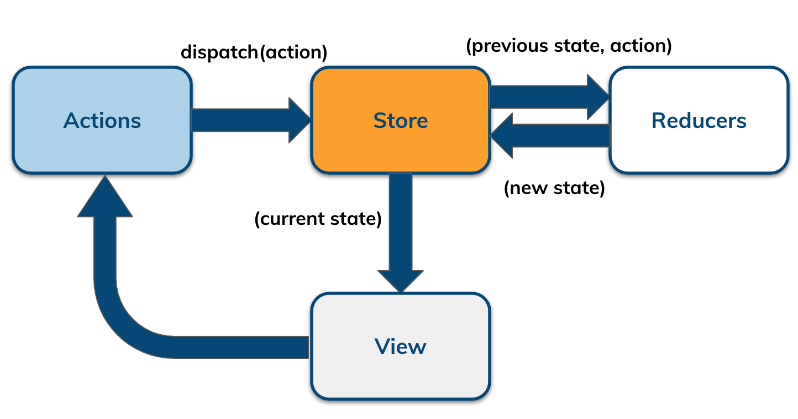
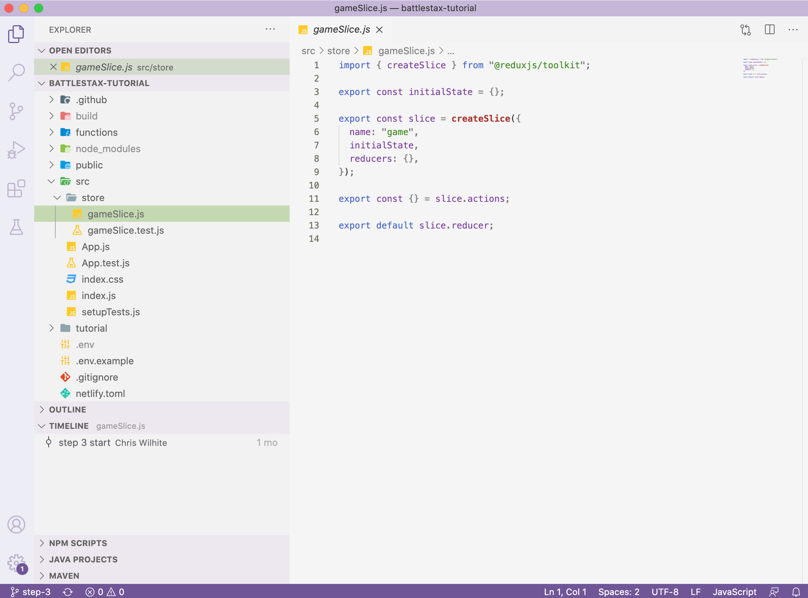
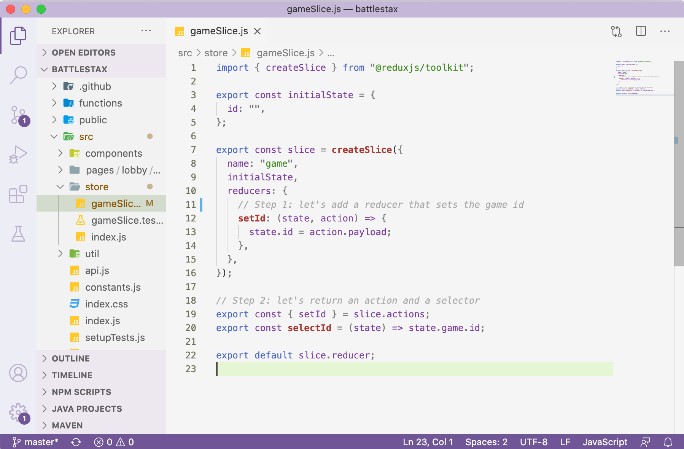

# 03. Create client State

[](http://www.apache.org/licenses/LICENSE-2.0)
[](https://discord.com/widget?id=685554030159593522&theme=dark)
[](https://github.com/DataStax-Academy/battlestax/actions) 
[](https://app.netlify.com/sites/battlestax-tutorial/deploys)

⚒️ [Connect to your Astra database](./README_step02.md) > 📚 [What is Redux](./README_Redux.md) > ⚒️ **[Create client State](#)** |  **next=>** 📚 *[What is React](./README_React.md)*

## Objectives 

```diff
+ Redux Tool Kit (RTK) tremendously simplifies using Redux, elminating most of the issues most people have when using it.

+ We will use RTK for state management on the Client and see how it is working with Astra.

In step 3 of the Battlestax tutorial, we will:

+ Build out the game slice boilerplate code by implementing one reducer, exporting an action and a selector

+ Run tests to try out the functionality of our game slice
```

An application's state is divided into "slices" that are corresponding to each feature set of the application. 
Game state is saved in Astra and states writes go from the clients to the REST API (Netlify)
Clients read state from the Astra database as well through the state loop
The Lobby and Player clients stay connected, as once the state is updated, it will be propagated to all the clients.



In this step we will be working with the `/src/store/gameSlice.js` file on branch `step-3`

```bash
git checkout step-3
```

## 🗓️ Table of Contents

1. [Building a `gameSlice`](#1-building-a-gameSlice)
2. [Generating an action and a selector](#2-generate-an-action-and-a-selector)
3. [Running TDD tests](#3-running-tdd-tests)

## 1. Building a `gameSlice`

Let's use the  Redux Toolkit to build out the game slice that will set the game code as part of the state. Redux Toolkit allows us to write shorter logic that's easier to read, while still following the same Redux behavior and data flow. Open the `src/store/gameSlice.js` file to see skeleton code we have provided to get you started.



Lets discuss some of the parameters in `createSlice`.

* `initialState` - The initial state value for this slice of state.
* `name` - A string name for this slice of state. 
* `reducers` - Functions that determine changes to an application's state. It uses the action it receives to determine this change. Redux relies heavily on reducer functions that take the previous state and an action in order to execute the next state.

First, we need to create a reducer that will allow us to modify the game id: 

📘 **Code to copy**

```javascript
// let's add a reducer that sets the game id
setId: (state, action) => {
  state.id = action.payload;
},
```
### [🔝](#%EF%B8%8F-table-of-contents)

## 2. Generate an action and a selector

Now that we have a reducer, RTK will generate an action and a selector for us. 
* An **action** is functions that call reducers. An action dispatches a state change event, then the reducer gets that event and figures out what to do with it
* A **selector** (`selectId` in our case) is simply a function that accepts Redux state as an argument and returns data that is derived from that state. It is small function you write that can take the entire Redux state, and pick out a value from it. This will be useful in the next step of our app development.

Let's export the action and the selector for our game id. We can call actions and selector from other places in out code base. This will be useful in the next step of our app development.

📘 **Code to copy**

```javascript
// let's return an action and a selector
export const { setId } = slice.actions;
export const selectId = (state) => state.game.id;
```

The complete `gameSlice.js` file should look like this:



### [🔝](#%EF%B8%8F-table-of-contents)

## 3. Running TDD tests

We are provided with test cases `store/gameSlice.test.js` which will test that our slice we created working is in `store/gameSlice.js`. 


✔️  _TEST 1_: On the first run, our initial game state should be returned. The new state is equivalent to the next state.

```javascript
describe("game slice", () => {
  it("should return the initial state on first run", () => {
    const nextState = initialState;
    const result = reducer(undefined, {});
    expect(result).toEqual(nextState);
  });
```

✔️  _TEST 2_ : When we generate a game id, the state the new state to be equal to the new game id.
```javascript
it("should set a game id", () => {
    const gameId = generateGameId();
    const nextState = reducer(initialState, setId(gameId));
    const rootState = { game: nextState };
    expect(selectId(rootState)).toEqual(gameId);
  });
```

Now, we can run our tests using `npm test src/store/gameSlice.test.js` to see that we have a functioning game slice.

📘 **Command to execute**

`npm test src/store/gameSlice.test.js`

📗 **Expected output**


### [🔝](#%EF%B8%8F-table-of-contents)

**Click** below to move to the next section.

⚒️ [Connect to your Astra database](./README_step02.md) > 📚 [What is Redux](./README_Redux.md) > ⚒️ **[Create client State](#)** |  **next=>** 📚 *[What is React](./README_React.md)*


