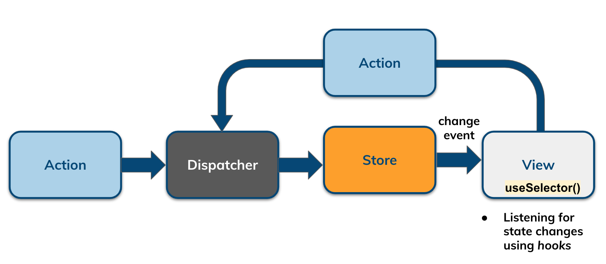
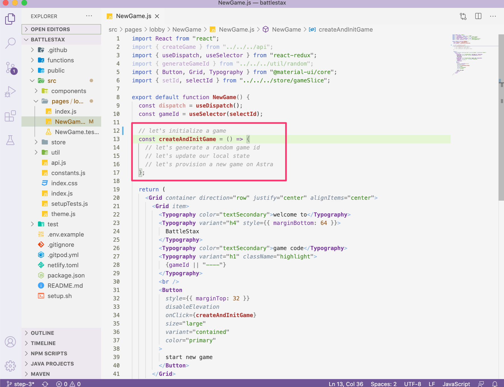
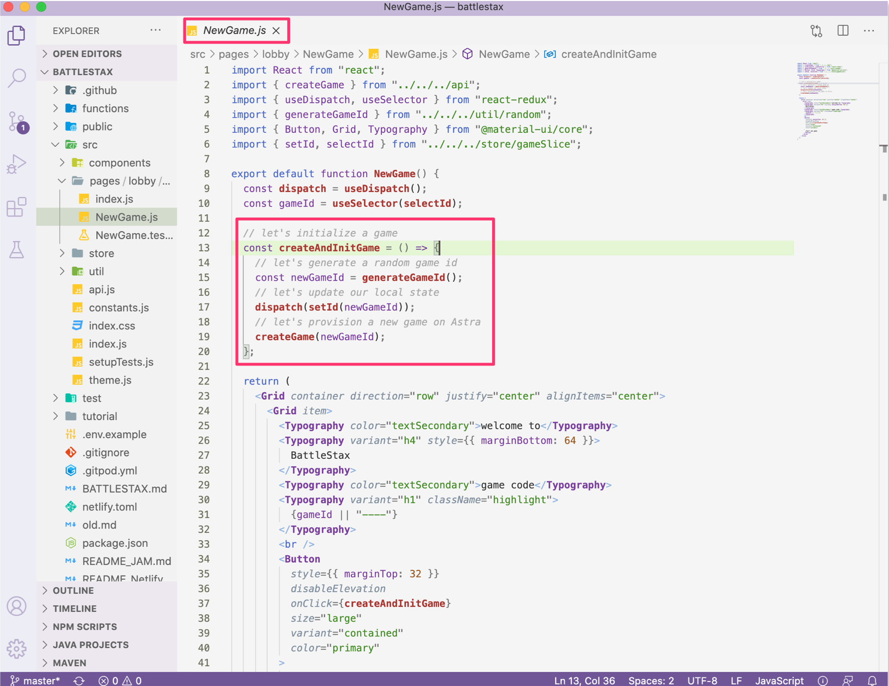
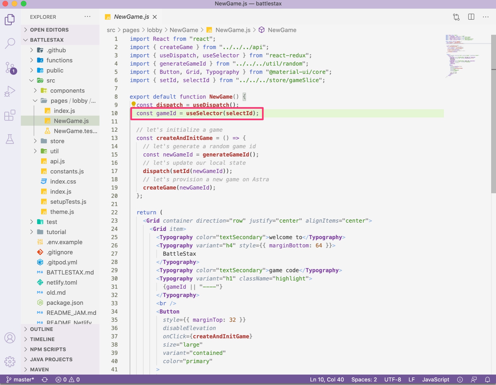
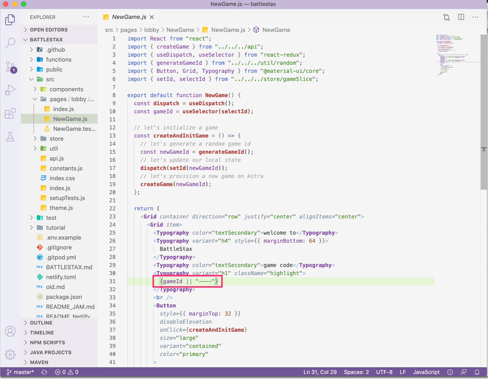
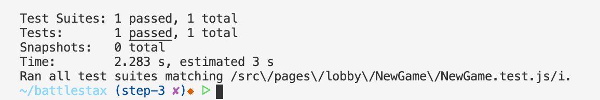

# 04. Connect your UI to your State

[](http://www.apache.org/licenses/LICENSE-2.0)
[](https://discord.com/widget?id=685554030159593522&theme=dark)
[](https://github.com/DataStax-Academy/battlestax/actions) 
[](https://app.netlify.com/sites/battlestax-tutorial/deploys)

⚒️ [Create client State](./README_step03.md) > 📚 [What is React](./README_React.md) > ⚒️ **[Connect your UI to your State](#)** | **next=>**  *[05. Final Something](./README_step05.md)*

## Objectives

```diff
+ React is a great way to build a UI, but we need to connect it to our game state.

In step 4 of the Battlestax tutorial, we will:

+ Build out the NewGame.js component by connecting it to redux.
 
+ Build a test to try out the functionality of NewGame.js
```

React is a popular open-source, front end, JavaScript library for building user interfaces or UI components. React makes user interfaces very easy to build by cutting each page into pieces called **components**. A React component is a bit of code that represents a piece of the page. Each component is a JavaScript function that returns a piece of code that represents a piece of a web page.

**Hooks** are a fairly new addition in React. They let you use state and other React features without writing a class. In this step, we will be using a hook to extract current state information from our Redux store.



In this step we will be working with `/src/pages/lobby/NewGame/NewGame.js` on branch `step-4`

```bash
git checkout step-4
```

1. [Start a new game from the UI](#1-start-a-new-game-from-the-UI)
2. [Implementing a React Hook](#-implementing-a-react-hook)
3. [Running TDD tests](#3-running-tdd-tests)


## 1. Start a new game from the UI

In order to change the game state, there needs to be an initial event that triggers an _action_. In our case, this comes from the initiation of a new game, via the NewGame.js component.




Once the `createAndInitGame` function is called, a new game id is created:

📘 **Code to copy**

```javascript
const newGameId = generateGameId();
```

This `newGameId` is dispatched to the store to update the local state:

📘 **Code to copy**

```javascript
// let's update our local state
dispatch(setId(newGameId));
```

Note the import of `setId` the store at the top of the `NewGame.js` code. At the same time, we send of our generated game id to Astra to provision a new game:

📘 **Code to copy**

```javascript
// let's provision a new game on Astra
 createGame(newGameId);
```



### [🔝](#%EF%B8%8F-table-of-contents)

## 2. Implementing a React Hook

React Hooks allow you to access things like state, React lifecycle methods, and other goodies in function components that were previously only available in class components. 



`useSelector()` is a React Hook which allows you to extract data from the Redux store state, using a selector function.

📘 **Code to copy**

```javascript
const gameId = useSelector(selectId);
```
We add the current state `gameId` to our view.



### [🔝](#%EF%B8%8F-table-of-contents)

## 3. Running TDD tests

We are provided with test cases `store/gameSlice.test.js`. This test will check to see if our `NewGame` compenent renders properly.


✔️  _TEST 1_: On the first run, our initial game state should be returned. The new state is equivalent to the next state.

```javascript
test("renders without crashing", () => {
  render(
    <Provider store={store}>
      <NewGame />
    </Provider>
  );
});
```

We can run our tests to see that we have a properly rendering component:
 
📘 **Command to execute**

```bash
npm test src/pages/lobby/NewGame/NewGame.test.js
```

📗 **Expected output**



### [🔝](#%EF%B8%8F-table-of-contents)

**Click** below to move to the next section.

⚒️ [Create client State](./README_step03.md) > 📚 [What is React](./README_React.md) > ⚒️ **[Connect your UI to your State](#)** | **next=>**  *[05. Final Something](./README_step05.md)*

